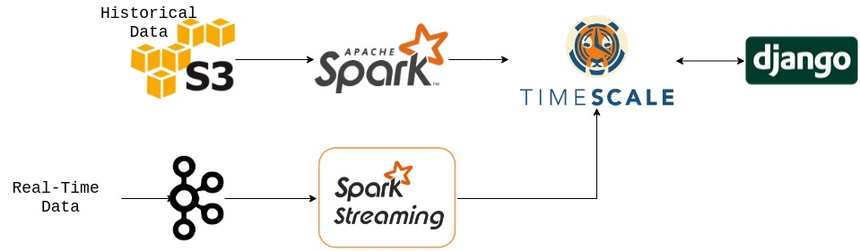

# Finding a parking spot in Seattle

* **Where can I find a parking spot near me?**
* **Where is a street/block to find a parking spot right now? or in 1 hour?**
* **How much will parking cost?**

## Data Source

#### Street Parking Occupancy data (Processed data)
[Data Source Link](https://data.seattle.gov/Transportation/2019-Paid-Parking-Occupancy-Year-to-date-/qktt-2bsy)
* Seattle.gov update the data with a week delay.
* Granularity of the data is by minute.
* About 290 million records in a year. (~45GB)
* Approx total of 1.4 billion records since 2012. (~320GB)

| TimeStamp        | StationID | Street Name |  # Occupaid spots           | # Total spots  | Max Park Mins
| ------------- |:-------------|:-----| -----:| -----:| -----:|
| 2019 Jan 02 08:41:00 AM      | 1 | 1ST AVE N BETWEEN JOHN ST AND THOMAS ST | 2 | 4 | 120
| 2019 Jan 02 08:42:00 AM      | 1 | 1ST AVE N BETWEEN JOHN ST AND THOMAS ST | 2 | 4 | 120
| 2019 Jan 02 08:42:00 AM      | 2 | SPRING ST BETWEEN 8TH AVE AND 9TH AVE | 4 | 5 | 30

#### Street Parking Transaction data (Raw data)
[Data Source Link](http://www.seattle.gov/Documents/Departments/SDOT/ParkingProgram/data/SeattlePaidTransactMetadata.pdf)
* About 13 million records in a year. (~11.1GB)
* Approx total of 90 million records since 2012. (~80GB)

| TimeStamp | Station ID | Amount $ | Paid Duration(sec)
|:----------|:---------------|---------:|--------------:|
| 12/01/2018 18:27:17 | 1 | 2.25 | 5400
| 12/01/2018 13:44:03 | 1 | 4 | 7200
| 12/01/2018 14:21:53 | 2 | 3 | 3600

# Pipeline

